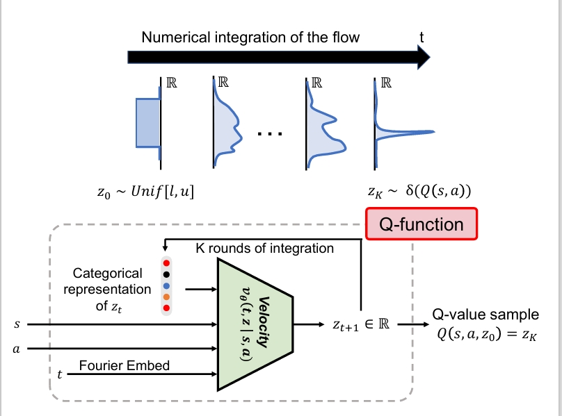

<div align="center">

<div id="user-content-toc" style="margin-bottom: 50px">
  <ul align="center" style="list-style: none;">
    <summary>
      <h1>floq: Training Critics Via Flow-Matching For Scaling Compute In Value-Based RL</h1>
      <br>
      <h2><a href="https://arxiv.org/abs/2509.06863">Paper</a></h2>
    </summary>
  </ul>
</div>



</div>

## Overview
A hallmark of modern large-scale machine learning techniques is the use of training objectives that provide dense supervision to intermediate computations, such as teacher forcing the next token in language models or denoising  step-by-step in diffusion models. This enables models to learn complex functions in a generalizable manner. Motivated by this observation, we investigate the benefits of iterative computation for temporal difference (TD) methods in reinforcement learning (RL). Typically they represent value functions in a monolithic fashion, without iterative compute. We introduce floq (flow-matching Q-functions), an approach that parameterizes the Q-function using a velocity field and trains it using techniques from flow-matching, typically used in generative modeling. This velocity field underneath the flow is trained using a TD-learning objective, which bootstraps from values produced by a target velocity field, computed by running multiple steps of numerical integration. Crucially,  floq allows for more fine-grained control and scaling of the Q-function capacity than monolithic architectures, by appropriately setting the number of integration steps. Across a suite of challenging offline RL benchmarks and online fine-tuning tasks, floq improves performance by nearly 1.8x. floq scales capacity far better than standard TD-learning architectures, highlighting the potential of iterative computation for value learning.
## Installation
```bash
conda env create -f conda-environment.yaml #replace the last line with the conda prefix on your system  
conda activate floqcritic
export MUJOCO_GL=egl
```

## Usage

The main implementation of floq is in [agents/floq.py](agents/floq.py),
and the baselines (FQL, FQL-IQN)
can also be found in the same directory.
Here are some example commands (see [the section below](#reproducing-the-main-results) for the complete list):
```bash
# floq on OGBench cube-double (offline RL)
python -u main.py --env_name=cube-double-play-singletask-v0 --agent=agents/floq.py --agent.alpha=300 --agent.block_depth=2
# floq on OGBench antmaze-giant (offline-to-online RL)
python -u main.py --env_name=antmaze-giant-navigate-singletask-v0 --offline_steps=1000000 --online_steps=2000000 --agent=agents/floq.py --agent.alpha=10 --agent.q_agg=min --agent.discount=0.995 --agent.batch_size=512 --agent.critic_flow_steps=4 
```

## Tips for hyperparameter tuning

Here are some general tips for floq's hyperparameter tuning for new tasks:

* Since floq is built on top of FQL, the BC coefficient (`--agent.alpha`) is the most important hyperparameter and needs to be individually tuned for each environment.

* For other hyperparameters, you may use the default values in `agents/floq.py` (floq-default in our paper) and get good performance.
  
  However, we found that tuning the number of critic flow steps (`--agent.critic_flow_steps`) and noise range (`--agent.noise_coverage`) significantly improved
  performance on several environments (floq-best in our paper). We recommend tuning the `--agent.critic_flow_steps` in {4,8,16} and `--agent.noise_coverage` in {0.1, 0.25} as
  good starting points.
  
  See the ablation study in the paper for more details.

## Reproducing the main results

We provide the complete list of the **exact command-line flags**
used to produce the main results of floq in the paper. We also provide the [wandbs](https://docs.google.com/spreadsheets/d/1qmLCJ11d9pzJA7OrACT10Y6HEr0RWv4eVoB0iOFMNqI/edit?usp=sharing). We ran three seeds (--seed=0, --seed=1, --seed=2) for each task.  

> [!NOTE]
> In OGBench, each environment provides five tasks, one of which is the default task.
> This task corresponds to the environment ID without any task suffixes.
> For example, the default task of `antmaze-large-navigate` is `task1`,
> and `antmaze-large-navigate-singletask-v0` is the same environment as `antmaze-large-navigate-singletask-task1-v0`.

<details>
<summary><b>Click to expand the full list of commands</b></summary>

### Offline RL

#### floq on state-based OGBench (default tasks)

```bash
# floq on OGBench antmaze-large-navigate-singletask-v0 (=antmaze-large-navigate-singletask-task1-v0)
python main.py --env_name=antmaze-large-navigate-singletask-v0 --agent=agents/floq.py --agent.alpha=10 

# floq on OGBench antmaze-giant-navigate-singletask-v0 (=antmaze-giant-navigate-singletask-task1-v0)
python main.py --env_name=antmaze-giant-navigate-singletask-v0 --agent=agents/floq.py --agent.discount=0.995 --agent.q_agg=min --agent.batch_size=512 --agent.alpha=10 #floq-def
python main.py --env_name=antmaze-giant-navigate-singletask-v0 --agent=agents/floq.py --agent.discount=0.995 --agent.q_agg=min --agent.batch_size=512 --agent.alpha=10\
--agent.critic_flow_steps=4 #floq-best

# floq on OGBench humanoidmaze-medium-navigate-singletask-v0 (=humanoidmaze-medium-navigate-singletask-task1-v0)
python main.py --env_name=humanoidmaze-medium-navigate-singletask-v0 --agent=agents/floq.py --agent.discount=0.995 --agent.alpha=30
# floq on OGBench humanoidmaze-large-navigate-singletask-v0 (=humanoidmaze-large-navigate-singletask-task1-v0)
python main.py --env_name=humanoidmaze-large-navigate-singletask-v0 --agent=agents/floq.py --agent.discount=0.995 --agent.batch_size=512 --agent.alpha=20
# floq on OGBench antsoccer-arena-navigate-singletask-v0 (=antsoccer-arena-navigate-singletask-task4-v0)
python main.py --env_name=antsoccer-arena-navigate-singletask-v0 --agent=agents/floq.py --agent.discount=0.995 --agent.alpha=10
# floq on OGBench cube-single-play-singletask-v0 (=cube-single-play-singletask-task2-v0)
python main.py --env_name=cube-single-play-singletask-v0 --agent=agents/floq.py --agent.alpha=300 --agent.block_depth=2
# floq on OGBench cube-double-play-singletask-v0 (=cube-double-play-singletask-task2-v0)
python main.py --env_name=cube-double-play-singletask-v0 --agent=agents/floq.py --agent.alpha=300 --agent.block_depth=2
# floq on OGBench scene-play-singletask-v0 (=scene-play-singletask-task2-v0)
python main.py --env_name=scene-play-singletask-v0 --agent=agents/floq.py --agent.alpha=300
# floq on OGBench puzzle-3x3-play-singletask-v0 (=puzzle-3x3-play-singletask-task4-v0)
python main.py --env_name=puzzle-3x3-play-singletask-v0 --agent=agents/floq.py --agent.alpha=1000
# floq on OGBench puzzle-4x4-play-singletask-v0 (=puzzle-4x4-play-singletask-task4-v0)
python main.py --env_name=puzzle-4x4-play-singletask-v0 --agent=agents/floq.py --agent.alpha=1000 #floq-def
python main.py --env_name=puzzle-4x4-play-singletask-v0 --agent=agents/floq.py --agent.alpha=1000 --agent.noise_coverage=0.25 #floq-best
```

#### floq on state-based OGBench (all tasks)

```bash
# floq on OGBench antmaze-large-navigate-singletask-{task1, task2, task3, task4, task5}-v0 (default: task1)
python main.py --env_name=antmaze-large-navigate-singletask-task1-v0 --agent=agents/floq.py --agent.alpha=10
python main.py --env_name=antmaze-large-navigate-singletask-task2-v0 --agent=agents/floq.py --agent.alpha=10
python main.py --env_name=antmaze-large-navigate-singletask-task3-v0 --agent=agents/floq.py --agent.alpha=10
python main.py --env_name=antmaze-large-navigate-singletask-task4-v0 --agent=agents/floq.py --agent.alpha=10
python main.py --env_name=antmaze-large-navigate-singletask-task5-v0 --agent=agents/floq.py --agent.alpha=10

# floq on OGBench antmaze-giant-navigate-singletask-{task1, task2, task3, task4, task5}-v0 (default: task1)
python main.py --env_name=antmaze-giant-navigate-singletask-task1-v0 --agent=agents/floq.py --agent.discount=0.995 --agent.q_agg=min --agent.batch_size=512 --agent.alpha=10 #floq-def
python main.py --env_name=antmaze-giant-navigate-singletask-task2-v0 --agent=agents/floq.py --agent.discount=0.995 --agent.q_agg=min --agent.batch_size=512 --agent.alpha=10 #floq-def
python main.py --env_name=antmaze-giant-navigate-singletask-task3-v0 --agent=agents/floq.py --agent.discount=0.995 --agent.q_agg=min --agent.batch_size=512 --agent.alpha=10 #floq-def
python main.py --env_name=antmaze-giant-navigate-singletask-task4-v0 --agent=agents/floq.py --agent.discount=0.995 --agent.q_agg=min --agent.batch_size=512 --agent.alpha=10 #floq-def
python main.py --env_name=antmaze-giant-navigate-singletask-task5-v0 --agent=agents/floq.py --agent.discount=0.995 --agent.q_agg=min --agent.batch_size=512 --agent.alpha=10 #floq-def

python main.py --env_name=antmaze-giant-navigate-singletask-task1-v0 --agent=agents/floq.py --agent.discount=0.995 --agent.q_agg=min --agent.batch_size=512 --agent.alpha=10\
--agent.critic_flow_steps=4 #floq-best
python main.py --env_name=antmaze-giant-navigate-singletask-task2-v0 --agent=agents/floq.py --agent.discount=0.995 --agent.q_agg=min --agent.batch_size=512 --agent.alpha=10\
--agent.critic_flow_steps=4 #floq-best
python main.py --env_name=antmaze-giant-navigate-singletask-task3-v0 --agent=agents/floq.py --agent.discount=0.995 --agent.q_agg=min --agent.batch_size=512 --agent.alpha=10\
--agent.critic_flow_steps=4 #floq-best
python main.py --env_name=antmaze-giant-navigate-singletask-task4-v0 --agent=agents/floq.py --agent.discount=0.995 --agent.q_agg=min --agent.batch_size=512 --agent.alpha=10\
--agent.critic_flow_steps=4 #floq-best
python main.py --env_name=antmaze-giant-navigate-singletask-task5-v0 --agent=agents/floq.py --agent.discount=0.995 --agent.q_agg=min --agent.batch_size=512 --agent.alpha=10\
--agent.critic_flow_steps=4 #floq-best

# floq on OGBench humanoidmaze-medium-navigate-singletask-{task1, task2, task3, task4, task5}-v0 (default: task1)
python main.py --env_name=humanoidmaze-medium-navigate-singletask-task1-v0 --agent=agents/floq.py --agent.discount=0.995 --agent.alpha=30
python main.py --env_name=humanoidmaze-medium-navigate-singletask-task2-v0 --agent=agents/floq.py --agent.discount=0.995 --agent.alpha=30
python main.py --env_name=humanoidmaze-medium-navigate-singletask-task3-v0 --agent=agents/floq.py --agent.discount=0.995 --agent.alpha=30
python main.py --env_name=humanoidmaze-medium-navigate-singletask-task4-v0 --agent=agents/floq.py --agent.discount=0.995 --agent.alpha=30
python main.py --env_name=humanoidmaze-medium-navigate-singletask-task5-v0 --agent=agents/floq.py --agent.discount=0.995 --agent.alpha=30
# floq on OGBench humanoidmaze-large-navigate-singletask-{task1, task2, task3, task4, task5}-v0 (default: task1)
python main.py --env_name=humanoidmaze-large-navigate-singletask-task1-v0 --agent=agents/floq.py --agent.discount=0.995 --agent.batch_size=512 --agent.alpha=20
python main.py --env_name=humanoidmaze-large-navigate-singletask-task2-v0 --agent=agents/floq.py --agent.discount=0.995 --agent.batch_size=512 --agent.alpha=20
python main.py --env_name=humanoidmaze-large-navigate-singletask-task3-v0 --agent=agents/floq.py --agent.discount=0.995 --agent.batch_size=512 --agent.alpha=20
python main.py --env_name=humanoidmaze-large-navigate-singletask-task4-v0 --agent=agents/floq.py --agent.discount=0.995 --agent.batch_size=512 --agent.alpha=20
python main.py --env_name=humanoidmaze-large-navigate-singletask-task5-v0 --agent=agents/floq.py --agent.discount=0.995 --agent.batch_size=512 --agent.alpha=20
# floq on OGBench antsoccer-arena-navigate-singletask-{task1, task2, task3, task4, task5}-v0 (default: task4)
python main.py --env_name=antsoccer-arena-navigate-singletask-task1-v0 --agent=agents/floq.py --agent.discount=0.995 --agent.alpha=10
python main.py --env_name=antsoccer-arena-navigate-singletask-task2-v0 --agent=agents/floq.py --agent.discount=0.995 --agent.alpha=10
python main.py --env_name=antsoccer-arena-navigate-singletask-task3-v0 --agent=agents/floq.py --agent.discount=0.995 --agent.alpha=10
python main.py --env_name=antsoccer-arena-navigate-singletask-task4-v0 --agent=agents/floq.py --agent.discount=0.995 --agent.alpha=10
python main.py --env_name=antsoccer-arena-navigate-singletask-task5-v0 --agent=agents/floq.py --agent.discount=0.995 --agent.alpha=10
# floq on OGBench cube-single-play-singletask-{task1, task2, task3, task4, task5}-v0 (default: task2)
python main.py --env_name=cube-single-play-singletask-task1-v0 --agent=agents/floq.py --agent.alpha=300 --agent.block_depth=2
python main.py --env_name=cube-single-play-singletask-task2-v0 --agent=agents/floq.py --agent.alpha=300 --agent.block_depth=2
python main.py --env_name=cube-single-play-singletask-task3-v0 --agent=agents/floq.py --agent.alpha=300 --agent.block_depth=2
python main.py --env_name=cube-single-play-singletask-task4-v0 --agent=agents/floq.py --agent.alpha=300 --agent.block_depth=2
python main.py --env_name=cube-single-play-singletask-task5-v0 --agent=agents/floq.py --agent.alpha=300 --agent.block_depth=2
# floq on OGBench cube-double-play-singletask-{task1, task2, task3, task4, task5}-v0 (default: task2)
python main.py --env_name=cube-double-play-singletask-task1-v0 --agent=agents/floq.py --agent.alpha=300 --agent.block_depth=2
python main.py --env_name=cube-double-play-singletask-task2-v0 --agent=agents/floq.py --agent.alpha=300 --agent.block_depth=2
python main.py --env_name=cube-double-play-singletask-task3-v0 --agent=agents/floq.py --agent.alpha=300 --agent.block_depth=2
python main.py --env_name=cube-double-play-singletask-task4-v0 --agent=agents/floq.py --agent.alpha=300 --agent.block_depth=2
python main.py --env_name=cube-double-play-singletask-task5-v0 --agent=agents/floq.py --agent.alpha=300 --agent.block_depth=2
# floq on OGBench scene-play-singletask-{task1, task2, task3, task4, task5}-v0 (default: task2)
python main.py --env_name=scene-play-singletask-task1-v0 --agent=agents/floq.py --agent.alpha=300
python main.py --env_name=scene-play-singletask-task2-v0 --agent=agents/floq.py --agent.alpha=300
python main.py --env_name=scene-play-singletask-task3-v0 --agent=agents/floq.py --agent.alpha=300
python main.py --env_name=scene-play-singletask-task4-v0 --agent=agents/floq.py --agent.alpha=300
python main.py --env_name=scene-play-singletask-task5-v0 --agent=agents/floq.py --agent.alpha=300
# floq on OGBench puzzle-3x3-play-singletask-{task1, task2, task3, task4, task5}-v0 (default: task4)
python main.py --env_name=puzzle-3x3-play-singletask-task1-v0 --agent=agents/floq.py --agent.alpha=1000
python main.py --env_name=puzzle-3x3-play-singletask-task2-v0 --agent=agents/floq.py --agent.alpha=1000
python main.py --env_name=puzzle-3x3-play-singletask-task3-v0 --agent=agents/floq.py --agent.alpha=1000
python main.py --env_name=puzzle-3x3-play-singletask-task4-v0 --agent=agents/floq.py --agent.alpha=1000
python main.py --env_name=puzzle-3x3-play-singletask-task5-v0 --agent=agents/floq.py --agent.alpha=1000
# floq on OGBench puzzle-4x4-play-singletask-{task1, task2, task3, task4, task5}-v0 (default: task4)
python main.py --env_name=puzzle-4x4-play-singletask-task1-v0 --agent=agents/floq.py --agent.alpha=1000 #floq-def
python main.py --env_name=puzzle-4x4-play-singletask-task2-v0 --agent=agents/floq.py --agent.alpha=1000 #floq-def
python main.py --env_name=puzzle-4x4-play-singletask-task3-v0 --agent=agents/floq.py --agent.alpha=1000 #floq-def
python main.py --env_name=puzzle-4x4-play-singletask-task4-v0 --agent=agents/floq.py --agent.alpha=1000 #floq-def
python main.py --env_name=puzzle-4x4-play-singletask-task5-v0 --agent=agents/floq.py --agent.alpha=1000 #floq-def

python main.py --env_name=puzzle-4x4-play-singletask-task1-v0 --agent=agents/floq.py --agent.alpha=1000 --agent.noise_coverage=0.25 #floq-best
python main.py --env_name=puzzle-4x4-play-singletask-task2-v0 --agent=agents/floq.py --agent.alpha=1000 --agent.noise_coverage=0.25 #floq-best
python main.py --env_name=puzzle-4x4-play-singletask-task3-v0 --agent=agents/floq.py --agent.alpha=1000 --agent.noise_coverage=0.25 #floq-best
python main.py --env_name=puzzle-4x4-play-singletask-task4-v0 --agent=agents/floq.py --agent.alpha=1000 --agent.noise_coverage=0.25 #floq-best
python main.py --env_name=puzzle-4x4-play-singletask-task5-v0 --agent=agents/floq.py --agent.alpha=1000 --agent.noise_coverage=0.25 #floq-best

```


#### FQL and FQL-IQN Baselines (examples)

```bash
# FQL on OGBench humanoidmaze-large-navigate-singletask-v0
python main.py --env_name=humanoidmaze-large-navigate-singletask-v0 --agent=agents/fql.py --agent.discount=0.995 --agent.alpha=30 --agent.batch_size=512
# FQL-ResNet on OGBench humanoidmaze-large-navigate-singletask-v0
python main.py --env_name=humanoidmaze-large-navigate-singletask-v0 --agent=agents/fql.py --agent.discount=0.995 --agent.alpha=20 --agent.batch_size=512\
--agent.use_resnets=True --agent.block_width=512 --agent.block_depth=2 --agent.num_transformations=4 
# FQL-ResNet on OGBench antmaze-giant-navigate-singletask-v0
python main.py --env_name=antmaze-giant-navigate-singletask-v0 --agent=agents/fql.py --agent.discount=0.995  --agent.alpha=10 --agent.q_agg=min --agent.batch_size=512\
--agent.use_resnets=True --agent.block_width=512 --agent.block_depth=4 --agent.num_transformations=2
# FQL-IQN on OGBench antmaze-giant-navigate-singletask-v0
python main.py --env_name=antmaze-giant-navigate-singletask-v0 --agent=agents/fql_iqn.py --agent.discount=0.995 --agent.alpha=10  --agent.q_agg=min --agent.batch_size=512 
```

### Offline-to-online RL

#### floq

```bash
# floq on OGBench antmaze-large-navigate-singletask-v0 (=antmaze-large-navigate-singletask-task1-v0)
python main.py --env_name=antmaze-large-navigate-singletask-v0 --offline_steps=1000000 --online_steps=2000000 --agent=agents/floq.py --agent.alpha=10 

# floq on OGBench antmaze-giant-navigate-singletask-v0 (=antmaze-giant-navigate-singletask-task1-v0)
python main.py --env_name=antmaze-giant-navigate-singletask-v0 --offline_steps=1000000 --online_steps=2000000 --agent=agents/floq.py --agent.discount=0.995 --agent.q_agg=min\ --agent.batch_size=512 --agent.alpha=10 --agent.critic_flow_steps=4

# floq on OGBench humanoidmaze-medium-navigate-singletask-v0 (=humanoidmaze-medium-navigate-singletask-task1-v0)
python main.py --env_name=humanoidmaze-medium-navigate-singletask-v0 --offline_steps=1000000 --online_steps=2000000 --agent=agents/floq.py --agent.discount=0.995\
--agent.alpha=30
# floq on OGBench humanoidmaze-large-navigate-singletask-v0 (=humanoidmaze-large-navigate-singletask-task1-v0)
python main.py --env_name=humanoidmaze-large-navigate-singletask-v0 --offline_steps=1000000 --online_steps=2000000 --agent=agents/floq.py --agent.discount=0.995\
--agent.batch_size=512 --agent.alpha=20 --agent.critic_flow_steps=16
# floq on OGBench antsoccer-arena-navigate-singletask-v0 (=antsoccer-arena-navigate-singletask-task4-v0)
python main.py --env_name=antsoccer-arena-navigate-singletask-v0 --offline_steps=1000000 --online_steps=2000000 --agent=agents/floq.py --agent.discount=0.995 --agent.alpha=30
# floq on OGBench cube-single-play-singletask-v0 (=cube-single-play-singletask-task2-v0)
python main.py --env_name=cube-single-play-singletask-v0 --offline_steps=1000000 --online_steps=2000000 --agent=agents/floq.py --agent.alpha=300 --agent.block_depth=2
# floq on OGBench cube-double-play-singletask-v0 (=cube-double-play-singletask-task2-v0)
python main.py --env_name=cube-double-play-singletask-v0 --offline_steps=1000000 --online_steps=2000000 --agent=agents/floq.py --agent.alpha=300 --agent.block_depth=2
# floq on OGBench scene-play-singletask-v0 (=scene-play-singletask-task2-v0)
python main.py --env_name=scene-play-singletask-v0 --offline_steps=1000000 --online_steps=2000000 --agent=agents/floq.py --agent.alpha=300
# floq on OGBench puzzle-3x3-play-singletask-v0 (=puzzle-3x3-play-singletask-task4-v0)
python main.py --env_name=puzzle-3x3-play-singletask-v0 --offline_steps=1000000 --online_steps=2000000 --agent=agents/floq.py --agent.alpha=1000
# floq on OGBench puzzle-4x4-play-singletask-v0 (=puzzle-4x4-play-singletask-task4-v0)
python main.py --env_name=puzzle-4x4-play-singletask-v0 --offline_steps=1000000 --online_steps=2000000 --agent=agents/floq.py --agent.alpha=1000 --agent.noise_coverage=0.25
```

#### FQL (examples)

```bash
# FQL on OGBench humanoidmaze-large-navigate-singletask-v0
python main.py --env_name=humanoidmaze-large-navigate-singletask-v0 --offline_steps=1000000 --online_steps=2000000 --agent=agents/fql.py --agent.discount=0.995 --agent.alpha=40 --agent.batch_size=512
```
</details>

## Acknowledgments
This codebase is built on top of [FQL](https://github.com/seohongpark/fql)'s reference implementations.
